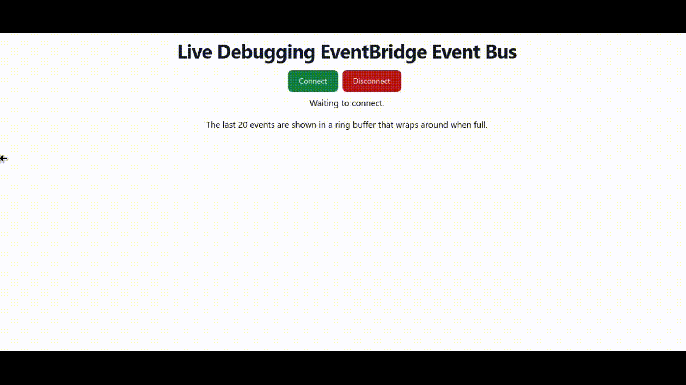

# live-debugging-eventbridge

This is an accompaniment to [a blog post] on a fun way to visualise events
flowing through your [Event Bridge Event Bus].

[a blog post]: https://jsherz.com/aws/eventbridge/event%20bus/2023/03/02/live-debugging-eventbridge-event-bus.html
[Event Bridge Event Bus]: https://docs.aws.amazon.com/eventbridge/latest/userguide/eb-event-bus.html

## Usage

The `ui` folder contains the React application based on create-react-app. The
`infrastructure` folder is a CDK project in TypeScript for hosting the UI and
related resources.

See the READMEs in each folder for deployment steps. The UI is just run locally
but could be easily built and deployed to an S3 bucket with CloudFront acting
as a Content Delivery Network (CDN).
